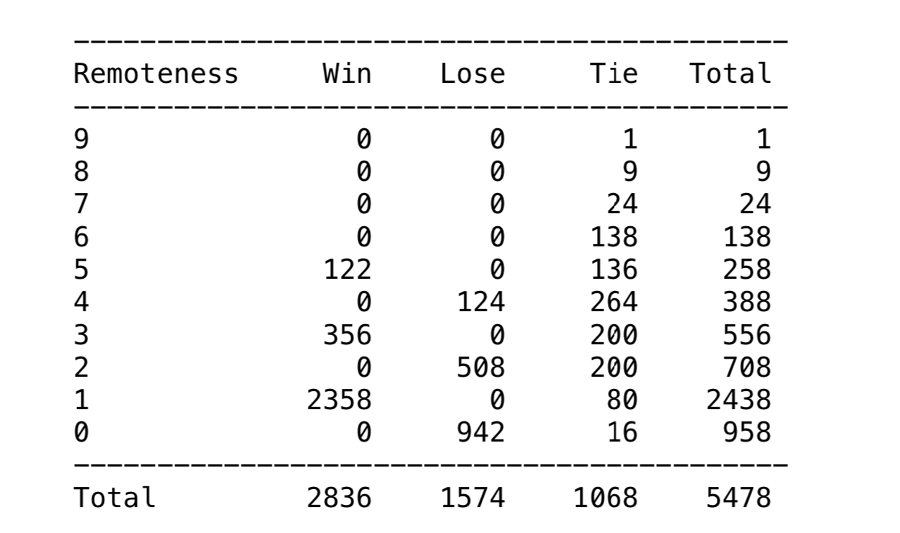

# TicTacToeSolver
A general solver that solves every possible position of the classic(3x3) Tic-Tac-Toe board.

Here are all the posistions, their values and remoteness of a general Tic-Tac-Toe game. 

